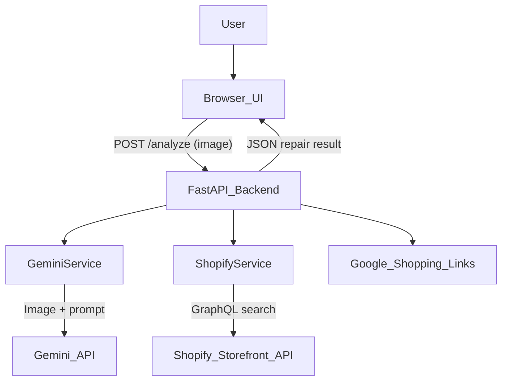

# RepairBOT — Product Requirements Document

> **Purpose**: This PRD is the single source of truth for implementing or extending RepairBOT. It is optimized for LLM consumption: use it to prompt AI assistants when building, debugging, or adding features.

---

## 1. Product Summary

RepairBOT is a web app that helps users decide whether and how to repair broken everyday objects. A user uploads a photo of a broken item (e.g., office chair with a broken wheel, cracked phone screen, malfunctioning appliance). The app uses Google Gemini to analyze the image and returns a repairability assessment, difficulty level, estimated cost and time, step-by-step repair instructions, and links to find or buy the suggested parts and tools. When connected to a Shopify store, RepairBOT prioritizes linking users directly to that store’s catalog for suggested parts and tools; for items not available in the store or when no store is configured, links fall back to Google Shopping searches (no API key required).

---

## 2. Goals & Non-Goals

### Goals (v1)

- Help non-expert users decide if an item is realistically repairable vs. replace-only.
- Provide clear estimates for cost and time before committing to a repair.
- Deliver concrete, actionable step-by-step repair instructions.
- Offer one-click links to find or buy parts and tools, prioritizing a connected Shopify store when available, with Google Shopping fallback.
- Support optional monetization via Shopify store integration.

### Non-Goals (v1)

- No user authentication or accounts.
- No persistent storage of repair history, bookmarks, or notifications.
- No multi-language UX (English only).
- No embeddable widget or third-party integration APIs.

---

## 3. Target Users & Use Cases

### Target Users

- **Office workers**: Broken chairs, desks, monitors, keyboards.
- **Home DIYers**: Minor furniture, appliance, or gadget issues.
- **Store owners**: Want to use RepairBOT as a helper for repair-related inventory and sales, with their own Shopify products shown first and automatic fallback to Google Shopping when items are not in their catalog.

### Use Cases

1. **Assess repairability**: User has a broken office chair wheel; uploads photo; gets "high repairability" and a short explanation.
2. **Estimate effort**: User wants to know cost and time before starting; gets "$20–50" and "30–60 min".
3. **Get instructions**: User needs step-by-step guidance; gets 4–10 ordered steps (safety first, disassembly, replace/repair, reassembly, test).
4. **Find parts and tools**: User needs to buy a replacement caster and screwdriver; gets direct links to search or buy each item.
5. **Shopify mode**: Store owner configures their store; for each suggested part/tool, RepairBOT searches the merchant’s Shopify catalog first and links to matching products when available, falling back to a Google Shopping search for that term when there is no suitable product.

---

## 4. Requirements

### Functional Requirements

| ID | Requirement | Notes |
|----|-------------|-------|
| FR-1 | User can upload an image via drag-and-drop or file picker | Accept `image/jpeg`, `image/png`, `image/webp`; max 10 MB |
| FR-2 | Backend validates image type and size before processing | Reject non-image or oversized files with 400 |
| FR-3 | Backend sends image to Gemini and receives structured JSON | See Section 8 for schema |
| FR-4 | Backend generates product links for parts and tools | When Shopify is configured, search Shopify first for each part/tool term and use the best match; otherwise or on miss/error, use a Google Shopping search URL for that term |
| FR-5 | Frontend displays repairability, difficulty, cost, time, description | Badges and text |
| FR-6 | Frontend displays step-by-step instructions (collapsible) | 4–10 steps |
| FR-7 | Frontend displays parts and tools with clickable links | One link per part/tool |
| FR-8 | Frontend shows loading state during analysis | Spinner + message |
| FR-9 | Frontend shows error state with retry path | Human-readable message |
| FR-10 | Shopify fallback: if product not in catalog, use Google Shopping link | Per-term fallback from Shopify to Google Shopping without failing the repair result |

### Non-Functional Requirements

| ID | Requirement | Notes |
|----|-------------|-------|
| NFR-1 | Analysis completes within ~30 seconds under normal load | Gemini latency |
| NFR-2 | Rate limit errors (429) return 503 with retry guidance | User-friendly message |
| NFR-3 | Images are not stored; used only for in-flight analysis | Privacy |
| NFR-4 | API keys and tokens are never logged or exposed | Security |

---

## 5. User Flows

### Main Flow (Shopify-first)

1. User lands on homepage; reads value prop and 3-step explanation.
2. User clicks "Start a repair"; navigates to app section.
3. User drops or selects an image; preview appears; "Analyze repair" enables.
4. User clicks "Analyze repair"; loading spinner shows.
5. Backend analyzes image with Gemini and, for each suggested part/tool term, queries the Shopify Storefront API when a store is configured, using Shopify product URLs when matches are found and falling back to Google Shopping search URLs when there are no suitable products or Shopify errors.
6. User sees result: badges, cost, time, description, instructions (collapsible), and parts/tools links that point to the merchant’s Shopify products when available (or Google Shopping when not).
7. User clicks a link; typically opens a Shopify product page in a new tab, or a Google Shopping search when no product exists.

### Alternative Flow (Google Shopping only)

1. No Shopify store is configured.
2. User follows the same steps as in the main flow to land on the app section and upload an image.
3. Backend analyzes the image with Gemini and generates Google Shopping search links for each suggested part/tool term.
4. User sees result: badges, cost, time, description, instructions (collapsible), and parts/tools links that all open Google Shopping searches in a new tab.

### Error Flow

1. User uploads invalid file (e.g., PDF) → 400; frontend shows "File must be an image".
2. User uploads image > 10 MB → 400; frontend shows size limit message.
3. Gemini rate limit (429) → 503; frontend shows "Rate limit reached. Please wait and try again."
4. Other server error → 500; frontend shows generic failure + retry suggestion.

---

## 6. System Architecture

### Components

- **Browser (frontend)**: React single-page application (SPA) that renders landing + upload + results views. Built and served as static assets by the FastAPI backend.
- **FastAPI backend**: Validates input, orchestrates Gemini and product-link services, returns JSON.
- **Gemini API**: Receives image + prompt; returns structured JSON (repair analysis).
- **Shopify Storefront API**: Optional; GraphQL search for products by term.
- **Google Shopping**: No API; URLs are `https://www.google.com/search?tbm=shop&q=<encoded_term>`.

### Data Flow



### File Layout

```
RepairBOT/
├── app/
│   ├── main.py          # FastAPI app, /analyze endpoint
│   ├── gemini_service.py
│   ├── shopify_service.py
│   └── config.py
├── frontend/
│   └── index.html        # React SPA entry point / built assets
├── requirements.txt
├── .env.example
└── PRD.md
```

### Frontend Tech Stack

- Use **React** (functional components and hooks) for the UI.
- Single-page layout with two main states:
  - Landing view (value prop + 3-step explanation).
  - App view (upload, loading state, results).
- Recommended components:
  - `App` – top-level shell handling navigation between landing and app sections (hash-based or simple conditional state).
  - `UploadCard` – drag-and-drop zone, file input, preview, and "Analyze repair" button.
  - `ResultsCard` – badges, description, step-by-step instructions, and parts/tools link lists.
- Networking: use `fetch` or `axios` in React to call `POST /analyze` with `FormData`.
- Styling: reuse the existing visual design from `frontend/index.html` as CSS-in-React (CSS modules, Tailwind, or plain CSS) without changing product behavior.

---

## 7. API & Data Contracts

### Endpoint: `POST /analyze`

#### Request

- **Content-Type**: `multipart/form-data`
- **Body**:
  - `image` (required): binary file
    - Allowed MIME types: `image/jpeg`, `image/png`, `image/webp`
    - Max size: 10 MB (10 * 1024 * 1024 bytes)

#### Response (200 OK)

JSON object with this exact shape:

```json
{
  "repairability": "low" | "medium" | "high",
  "difficulty": "easy" | "moderate" | "hard",
  "estimated_time": "string",
  "estimated_cost_usd": number | null,
  "brief_description": "string",
  "repair_steps": ["string", "..."],
  "parts_needed": ["string", "..."],
  "tools_needed": ["string", "..."],
  "products": {
    "parts": [{ "title": "string", "url": "string" }, "..."],
    "tools": [{ "title": "string", "url": "string" }, "..."],
    "source": "google_shopping" | "shopify"
  }
}
```

| Field | Type | Description |
|-------|------|--------------|
| `repairability` | enum | `"low"`, `"medium"`, `"high"` — likelihood repair is feasible |
| `difficulty` | enum | `"easy"`, `"moderate"`, `"hard"` — DIY effort level |
| `estimated_time` | string | e.g. `"15 min"`, `"30-60 min"`, `"1-2 hours"` |
| `estimated_cost_usd` | number \| null | Estimated cost in USD; `null` if unknown |
| `brief_description` | string | 1–2 sentences about damage and repair |
| `repair_steps` | string[] | 4–10 ordered steps; actionable for DIYer |
| `parts_needed` | string[] | 2–5 search-friendly part names suitable for both Shopify search and Google Shopping |
| `tools_needed` | string[] | 2–5 search-friendly tool names suitable for both Shopify search and Google Shopping |
| `products.parts` | object[] | One `{title, url}` per part |
| `products.tools` | object[] | One `{title, url}` per tool |
| `products.source` | enum | `"shopify"` when at least one suggested item is resolved via Shopify; otherwise `"google_shopping"` for a Google-only response |

#### Error Responses

| Status | Condition | Body |
|--------|-----------|------|
| 400 | Invalid file type (not image) | `{"detail": "File must be an image (e.g. image/jpeg, image/png)"}` |
| 400 | Image too large (> 10 MB) | `{"detail": "Image too large (max 10MB)"}` |
| 500 | Gemini analysis failed | `{"detail": "Analysis failed: <message>"}` |
| 503 | Gemini rate limit (429, quota, resource exhausted) | `{"detail": "Gemini rate limit reached. Please wait a minute or two and try again. Free-tier quotas reset over time."}` |

---

## 8. LLM Prompt & Schema Contract

### Model

- Default: `gemini-2.0-flash`
- Override via env: `GEMINI_MODEL`

### Input

1. **System prompt** (text): Instructs model to return only valid JSON with exact keys.
2. **Image part**: `{"inline_data": {"mime_type": "<mime>", "data": <base64_or_bytes>}}`

### Expected Output Schema (JSON)

```json
{
  "repairability": "low" | "medium" | "high",
  "difficulty": "easy" | "moderate" | "hard",
  "estimated_time": "string",
  "estimated_cost_usd": number | null,
  "brief_description": "string",
  "repair_steps": ["string"],
  "parts_needed": ["string"],
  "tools_needed": ["string"]
}
```

### Prompt Instructions (Key Points)

- Return **only** valid JSON; no markdown, no extra text.
- Use exact keys above; no additional keys.
- `repairability`: one of `"low"`, `"medium"`, `"high"`.
- `difficulty`: one of `"easy"`, `"moderate"`, `"hard"`.
- `estimated_time`: brief string, e.g. `"15 min"`, `"30-60 min"`, `"1-2 hours"`.
- `estimated_cost_usd`: number or `null` if unknown.
- `brief_description`: 1–2 sentences about damage and repair.
- `repair_steps`: 4–10 clear, ordered steps. Order: safety first, disassembly, replace/repair, reassembly, test. Each step one short sentence. Be specific to the image.
- `parts_needed`: 2–5 search-friendly part names (e.g. `"office chair caster wheel"`, `"replacement gas cylinder"`).
- `tools_needed`: 2–5 search-friendly tool names (e.g. `"Phillips screwdriver"`, `"adjustable wrench"`).
- When repairability is low or damage unclear: return `repairability: "low"`, concise description, minimal or empty steps/parts/tools.
- Avoid hazardous repair instructions; for dangerous repairs, recommend professional service.
- When specifics are unclear, suggest generic part/tool names rather than failing.

### Parsing & Fallback Rules

1. Strip leading/trailing whitespace from model output.
2. If output starts with ` ```json` or ` ``` `, remove the fence and trailing ` ``` `.
3. Parse with `json.loads`.
4. If parse fails: retry not applicable for parse errors; return 500 with generic message.
5. For 429 / quota / resource exhausted: retry with backoff (e.g. 2s, 6s, 15s); after max retries return 503.

### Backend Validation (Before Returning to Frontend)

- Ensure `repair_steps`, `parts_needed`, `tools_needed` are arrays (default `[]` if missing).
- Coerce `repairability` and `difficulty` to valid enums; fallback to `"medium"` / `"moderate"` if invalid.
- Ensure `products` object has `parts`, `tools`, `source`; backend adds this from `find_parts_and_tools()`.

---

## 9. Edge Cases, Safety & Open Questions

### Edge Cases

| Case | Desired Behavior |
|------|------------------|
| Image shows no clear damage | Return `repairability: "low"`, brief note that damage is unclear, empty or minimal steps/parts/tools |
| Image is blurry or low quality | Still attempt analysis; if impossible, return `repairability: "low"` with suggestion to upload clearer photo |
| Item is clearly not repairable (e.g. crushed) | Return `repairability: "low"`, brief explanation, empty steps; may suggest replacement |
| Dangerous repair (electrical, gas, structural) | Return instructions that recommend professional service; avoid step-by-step for hazardous work |
| Shopify returns no matches for a term | Use Google Shopping link for that term; do not fail the request |
| Shopify API or network error | Per-item fallback to Google Shopping; do not fail the request |
| Gemini returns malformed JSON | Attempt fence stripping once; if still invalid, return 500 |
| Gemini returns extra keys | Ignore extra keys; use only required keys |

### Safety

- Do not suggest repairs involving high voltage, gas lines, or structural load-bearing elements without recommending a professional.
- Include in prompt: "For dangerous repairs, recommend professional service and do not provide step-by-step instructions for hazardous work."

### Open Questions / TODOs

- [ ] Add optional synonyms config for Shopify to improve part/tool matching.
- [ ] Add basic observability (e.g. Shopify hit/miss rates) for debugging.
- [ ] Consider adding a disclaimer in the UI: "Repair at your own risk; seek professional help when in doubt."
